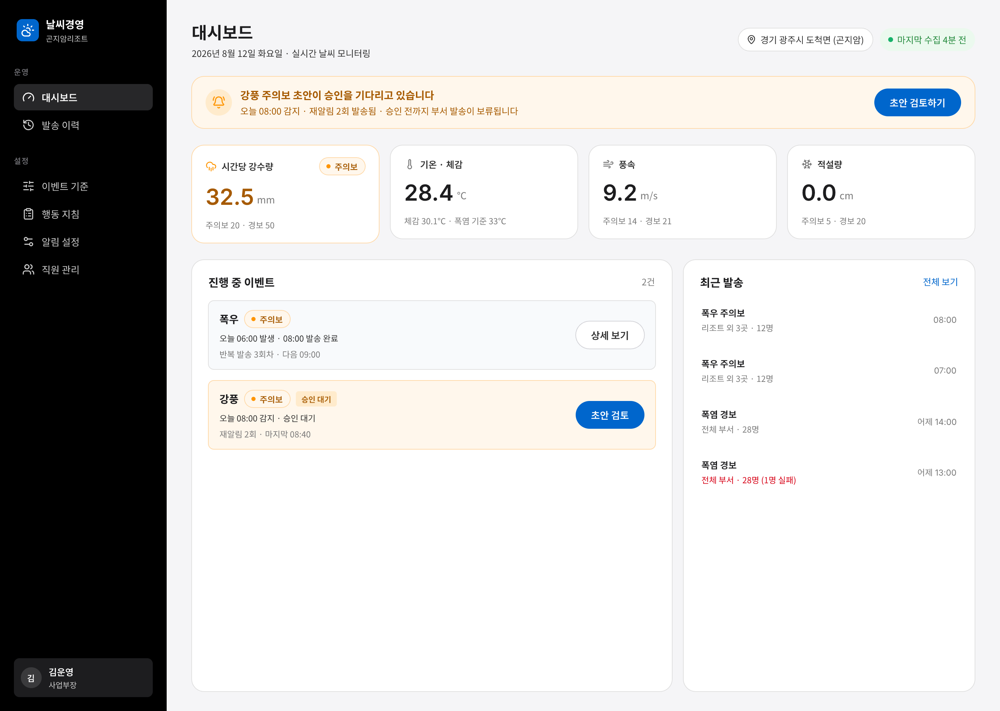
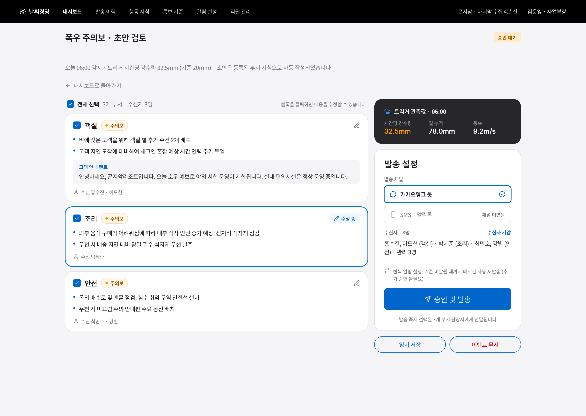
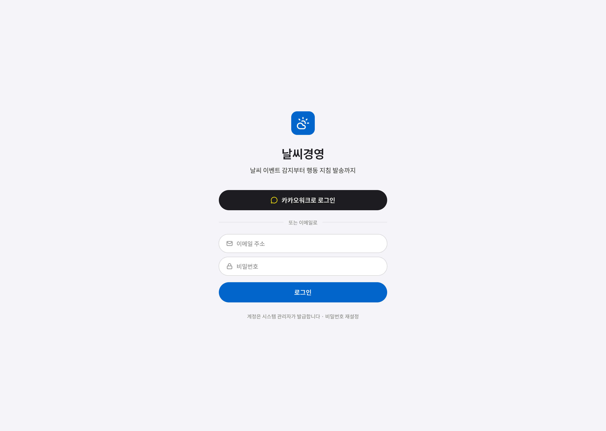

# 날씨경영

날씨 이벤트(폭우·폭설·강풍·폭염)가 임계값을 넘으면 자동으로 감지해 사업부장에게 알리고,
부서별로 미리 등록해 둔 행동 지침을 조합해 메시지 초안을 만들며, 사업부장 검토·승인 후
각 부서 담당자에게 카카오워크로 발송하는 시스템입니다. 리조트 운영 조직(예: 곤지암리조트류)을
염두에 두고 만들었고, 오픈소스 파일럿으로 누구나 클론해 자신의 조직에 붙일 수 있게 설계했습니다.

역할 구조는 Human-in-the-loop입니다: **System**(감지·조합·발송) → **사업부장**(승인·편집) → **실무자**(이행).

설계 배경과 결정 사항의 전체 맥락은 [`docs/superpowers/specs/2026-08-12-weather-management-design.md`](docs/superpowers/specs/2026-08-12-weather-management-design.md)에,
자체 호스팅으로 옮긴 이유와 설계는 [`docs/superpowers/specs/2026-08-28-self-hosted-migration-design.md`](docs/superpowers/specs/2026-08-28-self-hosted-migration-design.md)에 있습니다.

> **서버를 운영하는 분은 이 문서 말고 [`docs/운영.md`](docs/운영.md)를 보세요.**
> 설치·백업·복구·장애 대응을 서버 지식 없이 따라 할 수 있게 정리한 안내서입니다.
> 이 README는 코드를 고치는 사람을 위한 문서입니다.

## 1. 소개

### 아키텍처

Supabase(관리형 Postgres + Edge Functions) + Cloudflare 정적 호스팅으로 시작했지만,
사내망 전용 요구와 개인정보 보관 위치 때문에 **사내 서버 한 대 위의 Docker**로 옮겼습니다.
지금은 상시 떠 있는 컨테이너 2개가 전부입니다.

```
                    ┌──────────────────────── 사내 서버 (Docker) ────────────────────────┐
브라우저 ──HTTP──►  │  app (Node 22 / Express 5)                                          │
  :8080            │   ├─ 정적 서빙: apps/web 빌드 결과(dist)를 그대로 내보낸다           │
                   │   ├─ /api/*      : 인증·대시보드·조직·콘텐츠·발송                    │
                   │   ├─ /api/health : 프로세스가 살아 있는가                            │
                   │   ├─ /api/health/deep : 실제로 일을 하고 있는가(503이면 문제)        │
                   │   └─ 스케줄러(node-cron, KST 고정)                                   │
                   │        ├─ 매시 5분   weather-tick  ← 기상청 초단기실황                │
                   │        ├─ 10분마다   remind-tick                                     │
                   │        ├─ 매일 04시  세션 정리                                        │
                   │        └─ 6시간마다  watchdog → 문제면 카카오워크 DM                 │
                   │                    │                                                 │
                   │                    ▼ pg (RLS 적용 접속 / 우회 접속을 분리)           │
                   │  postgres (16-alpine)  ── 볼륨 pgdata                                │
                   │                                                                       │
                   │  migrate (1회성) — up 할 때마다 스키마를 최신으로 맞추고 종료          │
                   └───────────────────────────────────────────────────────────────────────┘
                              └──► 카카오워크 봇 API (발송·승인 알림·점검 알림)
```

- **화면(`apps/web`)** — Vite + React + TypeScript + Tailwind v4. 환경변수가 없습니다.
  서버와는 같은 오리진의 상대경로(`/api/...`)로만 이야기합니다. 프로덕션에서는
  `server/Dockerfile`이 빌드해 이미지 안 `/app/public`에 넣고 Express가 서빙합니다.
- **서버(`server`)** — Express 5. 라우터 등록 순서가 기능입니다(기능 라우터 → `/api` 404 JSON
  → `express.static` → SPA 폴백 → 에러 미들웨어). `server/test/static.test.ts`가 그 순서를
  양방향으로 고정합니다.
- **권한** — Postgres RLS 정책을 그대로 씁니다. `withUser()`는 정책이 적용되는 역할
  (`app_user`)로, `withService()`는 우회하는 역할(`app_service`)로 **아예 다른 커넥션**으로
  접속합니다. 한 커넥션에서 역할만 바꾸는 방식은 그 한 줄을 빠뜨렸을 때 RLS가 통째로
  우회된 채 조용히 통과하므로 쓰지 않습니다(`server/src/db.ts`).
- **로그인** — 사내 이메일 + 비밀번호(argon2) 방식의 자체 계정입니다(`auth_accounts`).
  Supabase Auth와 카카오워크 매직링크는 이관하면서 걷어냈습니다. 가입은
  `ALLOWED_EMAIL_DOMAINS`의 도메인만 허용하고, 가입해도 역할은 `staff`입니다 —
  실제 관문은 관리자의 역할 부여입니다.
- **주기 작업** — pg_cron이 pg_net으로 Edge Function을 HTTP 호출하던 구조를 걷어내고,
  앱 프로세스 안에서 `node-cron`으로 돕니다. cron 식은 **컨테이너 시계가 아니라 KST로
  못박혀** 있습니다(`server/src/jobs/scheduler.ts`).
- **감시** — 자체 서버는 조용히 죽습니다. `checkHealth()`가 "수집이 멈췄는가 / 결측만
  쌓이는가 / DB에 닿는가"를 보고, 6시간마다 문제가 있을 때만 알림 수신자에게 DM합니다
  (`server/src/jobs/watchdog.ts`).
- **NotificationChannel 어댑터** — 카카오워크 구현체 + 콘솔 구현체. 다른 채널을 붙이는
  확장 지점입니다(§6).

### TypeScript를 빌드하지 않고 그대로 싣습니다

프로덕션 컨테이너는 `node --experimental-transform-types src/index.ts`로 뜹니다
(`server/Dockerfile`). 별도 빌드 산출물이 없어 **배포되는 코드가 저장소의 코드와
글자 그대로 같다**는 장점이 있습니다. 대신 두 가지를 알고 있어야 합니다.

- 부팅할 때마다 `ExperimentalWarning: Transform Types is an experimental feature`가
  로그에 찍힙니다. **정상입니다.** 장애 조사 때 이 줄에 시간을 쓰지 마세요
  ([`docs/운영.md` §7-6](docs/운영.md)).
- `--experimental-strip-types`(지우기만 하는 모드)로는 뜨지 않습니다.
  `server/src/shared/kakaowork.ts`의 파라미터 프로퍼티(`constructor(private botKey: ...)`)가
  코드 생성을 요구하기 때문입니다. 그 파일은 발송 경로를 통해 반드시 로드됩니다.
- Node가 이 플래그의 동작을 바꾸면 컨테이너가 뜨지 않을 수 있습니다. Node 메이저 버전을
  올릴 때는 반드시 컨테이너를 실제로 띄워 확인하세요.

### 화면

|  |  |  |
|:---:|:---:|:---:|
| 대시보드 — 셋업 체크리스트·승인 대기·관측값 | 초안 검토·발송 — 부서 블록 편집·승인 | 로그인 — 사내 이메일 + 비밀번호 |

그 외 화면 미리보기는 `design/previews/`에 모두 있습니다 (기준 정의·지침 등록·발송 이력·알림 설정·직원 관리 등).
미리보기 이미지 일부는 Supabase 시절에 찍은 것이라 로그인 화면 등은 지금 화면과 다를 수 있습니다.

## 2. 사전 준비

### 기상청 공공데이터 API 키 발급

1. [공공데이터포털](https://www.data.go.kr)에 가입 후 **기상청_단기예보 조회서비스**(서비스 ID `15084084`)를
   활용신청합니다. 자동승인이라 신청 즉시 사용할 수 있습니다.
2. 마이페이지 → 개발계정 상세보기에서 **일반 인증키(Decoding)**를 복사합니다. 이 값이 `KMA_API_KEY`입니다.
   Encoding·Decoding 어느 쪽을 넣어도 동작합니다(코드가 자동으로 정규화합니다).
3. 관측 지점의 기상청 격자좌표(nx, ny)도 함께 확인해 두세요 — 설치 후 `site_settings`(설정 화면)에서 입력합니다.

### 카카오워크 봇 등록

1. 카카오워크 관리자 콘솔 → 앱 관리에서 **커스텀 봇을 생성**합니다. 발급된 **App Key**가 `KAKAOWORK_BOT_KEY`입니다.
   이 봇 키는 특보 발송, 승인 요청 알림, 상태 점검 알림에 사용됩니다.
2. 비워 두면 발송이 실제로 나가지 않고 로그에만 찍힙니다 — 설치 직후 점검용으로 유용합니다.
3. **중요**: 카카오워크 무료 플랜에서의 워크봇 API 가용 여부는 조직마다 다를 수 있습니다.
   실 배포 전에 실제 워크스페이스로 DM이 도착하는지 확인하세요.

### 서버

Docker와 Docker Compose만 있으면 됩니다. **호스트에 PostgreSQL이나 Node.js를 설치할
필요가 없습니다** — 전부 컨테이너 안에 있습니다.

## 3. 설치 (프로덕션 배포)

```bash
git clone <저장소 주소> weather && cd weather
cp .env.selfhost.example .env     # 값을 채운다 (비밀번호는 openssl rand -hex 24)
docker compose up -d --build      # postgres → migrate(스키마 적용) → app 순으로 뜬다
```

`docker compose up -d --build` 한 줄이 전부입니다. `migrate` 서비스가 앱보다 먼저 돌아
스키마와 기본값(부서 트리·특보 기준·알림 설정)을 넣고, 성공했을 때만 앱이 뜹니다
(`depends_on: service_completed_successfully`). 이미 적용한 마이그레이션은
`schema_migrations` 표를 보고 건너뛰므로 몇 번을 다시 올려도 안전합니다.

확인:

```bash
docker compose ps                            # app / postgres 가 Up (healthy)
curl -s localhost:8080/api/health/deep       # {"ok":true,"reasons":[]}
```

**설치 후 반드시 해야 하는 두 가지**가 있습니다. 둘 다 [`docs/운영.md`](docs/운영.md)에
단계별로 적혀 있습니다.

1. **첫 관리자 지정** — 새 데이터베이스에는 관리자가 0명입니다. 웹에서 가입한 뒤
   `./ops/make-admin.sh 본인이메일@회사.com`을 한 번 실행합니다(§1-5).
2. **부서별 행동지침 입력** — `action_guidelines`에는 시드가 없습니다(조직마다 다른
   내용이라 기본값을 둘 수 없습니다). 비워 두면 특보가 떠도 "무엇을 하라"가 붙지 않은
   메시지가 나갑니다. 대시보드의 셋업 체크리스트를 끝까지 진행하세요(§1-6).

### 환경변수

운영에서 채우는 값은 [`.env.selfhost.example`](.env.selfhost.example) 하나이고,
각 값이 무엇인지는 [`docs/운영.md` §8](docs/운영.md)의 표에 있습니다.
개발·테스트용 값은 [`.env.example`](.env.example)입니다.

| 변수 | 설명 |
|---|---|
| `POSTGRES_PASSWORD` | postgres 슈퍼유저 비밀번호. 볼륨을 처음 만들 때만 반영됩니다 |
| `APP_USER_PASSWORD` / `APP_SERVICE_PASSWORD` | RLS 적용 접속 / 우회 접속의 비밀번호. `db/migrations/0010_role_login.sql`이 부여합니다 |
| `ALLOWED_EMAIL_DOMAINS` | 가입 허용 이메일 도메인(콤마 구분) |
| `APP_BASE_URL` | 카카오워크 DM 링크의 기준 주소 |
| `KMA_API_KEY` | 기상청 일반 인증키(Decoding) |
| `KAKAOWORK_BOT_KEY` | 카카오워크 봇 App Key. 비우면 발송이 로그로만 나갑니다 |
| `NOTIFY_CHANNEL` | `console`이면 카카오워크 대신 로그로 발송(시연용). 운영에 남으면 모든 지표가 초록인 채로 아무에게도 도착하지 않는다 — `/api/health/deep`이 503으로 잡는다 |
| `COOKIE_SECURE` | HTTPS로 서비스할 때만 `true` |

### 백업

`ops/backup.sh`가 데이터베이스를 파일 하나로 덤프하고, `ops/restore.sh`가 되돌립니다.
크론 등록 방법과 복구 절차는 [`docs/운영.md` §4](docs/운영.md)에 있습니다.
**복구를 실제로 해 보기 전까지는 백업이 아닙니다.**

## 4. 최초 로그인

1. 브라우저에서 `http://서버주소:8080`에 들어가 **회사 이메일로 가입**합니다.
   가입 직후 역할은 `staff`이고, 조회만 됩니다.
2. 서버에서 `./ops/make-admin.sh 가입한이메일@회사.com`을 실행한 뒤 다시 로그인하면
   관리자 메뉴가 보입니다.
3. 대시보드 상단의 **셋업 체크리스트**를 순서대로 진행합니다.
   1. **관측 지점** — 기상청 격자좌표(nx, ny)와 지점명
   2. **특보 기준** — 4종 × 2등급 임계값 (기상청 특보 기준이 시드되어 있습니다)
   3. **부서 구성** — 부서 트리 (기본 트리가 시드되어 있습니다)
   4. **부서별 지침** — **시드가 없습니다.** 종류 × 등급 × 부서마다 직접 입력합니다
   5. **Alert 수신자** — 승인 알림과 상태 점검 알림을 받을 사업부장. 여기가 비면
      특보가 감지돼도 승인할 사람에게 알림이 가지 않습니다
4. 이후 가입하는 직원은 역할 `staff`, 부서 미지정으로 시작합니다. 직원 관리 화면의
   "부서 미지정 N명" 필터로 걸러 부서를 지정해 주세요.

관리자가 비밀번호를 잊었을 때의 복구 절차는 [`docs/운영.md` §6-2](docs/운영.md)에 있습니다
(자체 서비스 복구 경로가 없어 DB를 직접 손대야 합니다). **관리자는 처음부터 두 명 두세요.**

## 5. 로컬 개발

```bash
cp .env.example .env                    # 값을 채운다 (gitignore 대상)
docker compose up -d postgres           # Postgres만 띄운다 (호스트 127.0.0.1:5433)
docker compose run --rm migrate         # 스키마 + 시드 적용
```

이후 서버와 화면을 따로 띄웁니다.

```bash
cd server   && npm ci && npm run dev    # http://localhost:3000
cd apps/web && npm ci && npm run dev    # http://localhost:5173
```

`npm run dev`(5173)로 화면을 따로 띄우면 API 요청이 5173으로 나갑니다. 서버(3000)를 함께
띄우고 vite 프록시를 붙이거나, 빌드본을 서버가 서빙하게 해서 확인하세요.

### 테스트

서버 테스트는 **실제 Postgres에 붙습니다**(위 `docker compose up -d postgres`가 떠 있어야
합니다). `server/vitest.config.ts`가 저장소 루트 `.env`를 직접 읽어 접속 정보를 채우므로,
셸에 따로 export할 필요는 없습니다.

```bash
cd server   && npx vitest run    # 서버 (Postgres 필요)
cd apps/web && npm test          # 화면
cd apps/web && npm run build     # 화면 빌드 검증
```

`cd server && npx tsc --noEmit`은 `src/shared/`에서 8개의 오류를 냅니다. 그 7개 모듈은
`supabase/functions/_shared/`의 원본과 **바이트 단위로 같아야** 하고(이식의 핵심 보증)
어느 것도 런타임 버그가 아니라, 고치지 않기로 판단한 것입니다. 근거는
`server/tsconfig.json`에 적혀 있습니다. 프로덕션 컨테이너는 타입체크를 하지 않습니다.

### `supabase/`와 `scripts/scenario-test.ts`

이관 전 원본입니다. `server/src/shared/`가 `supabase/functions/_shared/`와 바이트 단위로
같은지 `diff`로 확인하는 기준이라 **아직 지우지 않았습니다.** 운영이 안정된 뒤에 지웁니다.
새 코드는 이쪽에 추가하지 마세요.

## 6. 라이선스 · 확장

MIT License — [`LICENSE`](LICENSE) 참고. 자유롭게 포크·수정·재배포할 수 있습니다.

### 알림 채널 확장하기

카카오워크 외 채널(알림톡, 슬랙, 이메일 등)을 붙이려면 `server/src/shared/channel.ts`의
`NotificationChannel` 인터페이스(`send(kakaoworkUserId, text): Promise<{ok, error?}>`)를 구현하는
클래스를 하나 추가하고, `server/src/shared/kakaowork.ts`의 `getChannel()`이 환경변수에 따라 그 구현체를
반환하도록 분기를 추가하면 됩니다 (기존 `KakaoWorkChannel`/`ConsoleChannel`이 참고 예시입니다).
